# Terraform Import

## Overview

This example shows how to import existing AWS resources into Terraform state and validate the imported configuration against the AWS Console.

The repository includes two import use cases:
- **EC2 instance import**
- **S3 bucket import**

## Objectives

- Import existing AWS resources into Terraform state
- Align Terraform configuration with remote console configuration
- Validate the imported resources using `terraform plan` and AWS screenshots

## Contents

- `main.tf` — Terraform configuration used for import
- `README.md` — this file
- `image-1.png` through `image-21.png` — validation screenshots
- `.terraform.lock.hcl` — Terraform dependency lock file
- `.terraform/` — Terraform working directory
- `terraform.tfstate` / `terraform.tfstate.backup` — local state files

> Note: In a real project, `.terraform/`, `terraform.tfstate`, and `terraform.tfstate.backup` should not be committed.

## Import Workflow

1. Create or update the resource block in `main.tf`
2. Run `terraform init`
3. Import the existing AWS resource with `terraform import`
4. Run `terraform plan`
5. Adjust the resource configuration until the plan shows no changes

## Example Commands

```bash
terraform init
terraform import aws_instance.example i-0123456789abcdef0
terraform import aws_s3_bucket.example my-bucket-name
terraform plan
```

## Key Terraform Import Concepts

- `terraform import` imports an existing resource into the state file only.
- It does not generate the resource block in the Terraform configuration.
- After import, your `.tf` code must exactly match the imported resource attributes.
- Use `terraform plan` to identify any drift between local config and remote state.

## Validation Process

### EC2 Import Validation

These screenshots document the EC2 import validation process, showing the AWS Console values compared with local Terraform configuration.

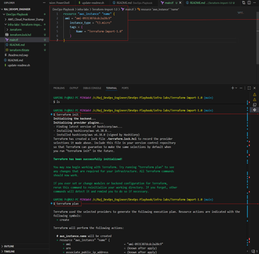

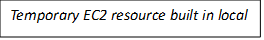

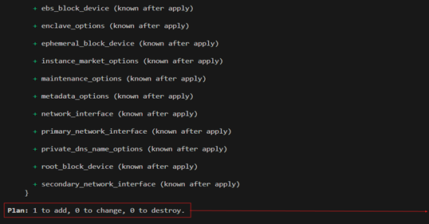

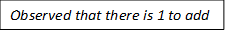

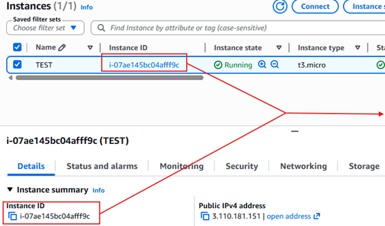

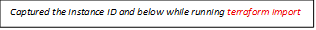

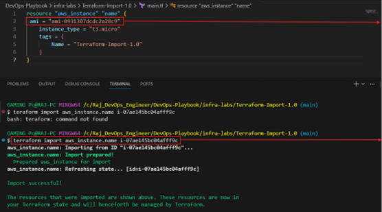

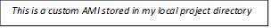

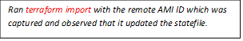

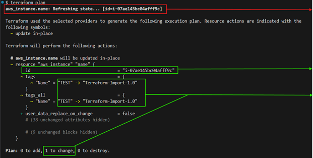

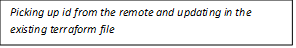

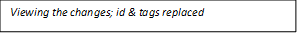

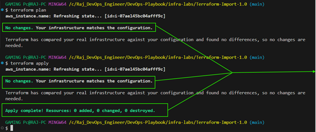

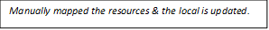

### S3 Import Validation

These screenshots document the S3 bucket import validation process.

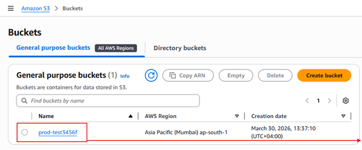

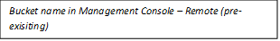

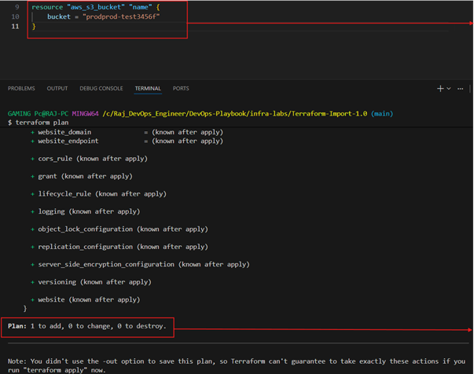

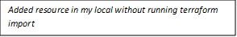

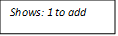

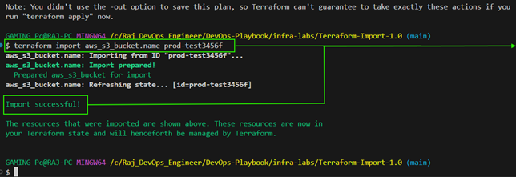

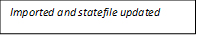

## Best Practices

- Use `terraform state list` to confirm imported resources are now managed by Terraform.
- Keep the imported configuration minimal until the state and code match.
- Avoid editing the state file manually unless absolutely necessary.
- Document the import process and any manual changes made.

## Result

After successful import and validation, Terraform can manage the existing AWS EC2 instance and S3 bucket without recreating them.

The imported resources should now appear in Terraform state and support future infrastructure changes through Terraform.


